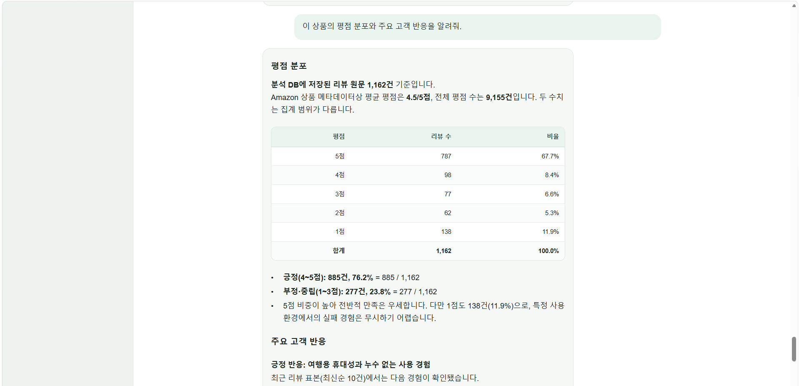
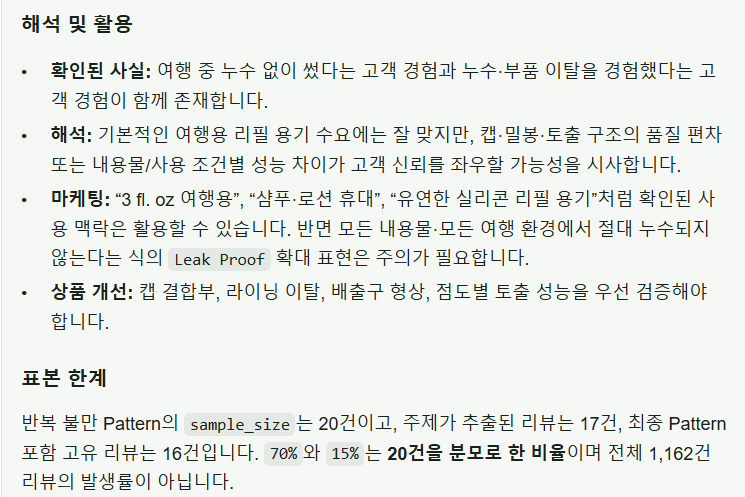

# Customer Intelligence Agent

[English](README_EN.md)

고객 리뷰와 상품 데이터를 분석하여 반복 불만, 제품 강·약점, 개선 우선순위를 근거와 함께 제공하는 고객 인텔리전스 에이전트입니다.

## 프로젝트 목표

마케팅·상품기획·VOC 담당자가 많은 리뷰를 직접 읽고 정리하는 과정을 줄이고, 자연어 질문만으로 다음과 같은 분석 결과를 얻도록 설계했습니다.

- 상품 기본 정보와 리뷰 현황 조회
- 평점 분포 및 부정 리뷰 비율 분석
- 공감도가 높은 리뷰와 반복 불만 패턴 분석
- 실제 리뷰에 근거한 제품 강·약점 분석
- 상품·상세페이지·운영 개선안 제안
- 마케팅에서 강조할 점과 과장하면 안 되는 표현 구분
- 존재하지 않는 상품과 검색 실패에 대한 안전한 예외 처리

## 데이터

- 데이터셋: Amazon Reviews 2023
- 카테고리: Beauty and Personal Care
- 상품: 547개
- 리뷰: 105,060건
- 부정·중립 리뷰(평점 3점 이하): 25,152건

`rating_number`는 Amazon 상품 메타데이터에 표시된 전체 평점 수이며, `review_count`는 현재 분석 데이터베이스에 저장된 리뷰 원문 수입니다.

검색 결과처럼 집계 출처가 Tool 출력에 명시되지 않은 경우에는 `review_count`를 **조회된 리뷰 수**로 표현하여 근거 범위를 넘는 설명을 방지합니다.

## 동작 방식

1. 사용자가 상품 또는 고객 반응에 관한 질문을 입력합니다.
2. 에이전트가 질문에 필요한 조회·분석 도구를 선택합니다.
3. 도구가 PostgreSQL에서 상품 정보와 리뷰 데이터를 조회합니다.
4. 반복 불만 분석이 필요한 경우 리뷰 패턴 추출 파이프라인을 실행합니다.
5. 에이전트가 정량 통계, 실제 리뷰 근거, 표본 한계를 종합합니다.
6. 주요 발견과 실행 가능한 개선안을 답변으로 제공합니다.

### 고객 리뷰 분석 경로


Agent는 질문에 맞는 검증된 SQL Tool을 선택합니다. Aspect Extractor가 조회된
리뷰에서 불만 유형과 근거 문장을 구조화하면, Python 코드가 원문 존재 여부를
확인하고 빈도와 표본 내 비율을 집계합니다. 최종 Agent는 검증된 집계 결과만
사용해 반복 불만과 개선 우선순위를 설명합니다.

### 정책 Hybrid RAG 경로


정책 질문은 사용자 권한과 정책 유효 범위를 먼저 적용합니다. PostgreSQL FTS와
Embedding 검색을 RRF로 결합하고, BGE-M3로 후보를 재정렬한 뒤 근거 유효성을
판정합니다. 충분한 근거가 있는 정책만 답변에 사용하며, 근거 부족·정책 충돌·
의료 및 안전 사안은 각각 정해진 안전 경로로 전환합니다.

## 서비스 화면

### 정책 근거 확인과 안전한 답변 보류


검색된 승인 정책이 질문을 직접 뒷받침하면 적용 범위와 출처를 함께 제시합니다.
금액·조건과 같은 핵심 근거를 찾지 못한 경우에는 내용을 추측하지 않고
**근거 부족** 상태를 표시해 담당 부서 확인이 필요함을 안내합니다.

### 정량 통계와 리뷰 근거를 결합한 상품 분석



평점 분포는 분석 DB에 저장된 리뷰 원문을 기준으로 계산하고, Amazon 상품
메타데이터의 전체 평점 수와 구분해 표시합니다. 정량 집계와 실제 리뷰 표현을
함께 사용해 고객 반응을 설명합니다.


공감표가 있는 저평점 리뷰에서 반복 불만 유형을 추출하고, 각 유형의 건수와
표본 내 비율을 근거 문장과 함께 제공합니다. LLM이 제시한 근거는 Python으로
리뷰 원문 포함 여부를 확인한 뒤 집계에 반영합니다.



확인된 고객 경험과 이를 바탕으로 한 해석·활용 방안을 구분합니다. 또한 선별된
표본의 비율을 전체 리뷰 발생률로 확대 해석하지 않도록 분석 범위와 한계를
답변에 명시합니다.

## 주요 설계 원칙

- ASIN이 주어지면 불필요한 상품 검색을 수행하지 않습니다.
- 사용자가 요청하지 않은 평점·기간·리뷰 수 조건을 임의로 추가하지 않습니다.
- 평점 분포만으로 불만 원인이나 고객 경험을 추론하지 않습니다.
- 리뷰 작성자의 경험·주장과 검증된 상품 정보를 구분합니다.
- 반복 불만 카테고리는 Pattern Tool이 반환한 라벨을 그대로 사용합니다.
- 표본 내 비율과 전체 고객의 실제 발생률을 구분합니다.
- 정품 여부, 안전성, 인과관계처럼 검증되지 않은 내용은 사실로 단정하지 않습니다.

## 기술 스택

- Python
- LangGraph / LangChain
- OpenAI API
- PostgreSQL / pgvector
- Docker Compose
- pandas / Parquet
- pytest

## Agent Evaluation

실제 PostgreSQL 데이터베이스와 OpenAI API를 사용하여 15개의 고객·상품 분석 시나리오를 평가했습니다.

평가는 다음 세 계층으로 구성됩니다.

- **Tool 평가:** 필수·선택·금지 Tool과 인자 조건 검증
- **Rule Checker:** 근거 없는 수치, Tool 사용 실패, 표본·집계 기준 오류 검증
- **LLM Judge:** 정확성, 근거성, 분석력, 업무 활용성을 각각 5점 척도로 평가


### 검증 범위와 해석

15개 고정 시나리오는 기능 회귀와 모델 비교를 위한 기준 세트입니다. 모든 사례가
통과했더라도 임의의 사용자 질문 전체에서 같은 성능을 보장한다는 의미는 아닙니다.
따라서 단일 종합 점수보다 아래처럼 시스템이 보장하는 부분과 모델 품질로 남겨 둔
부분을 구분해 평가합니다.

| 검증 영역 | 확인한 내용 | 결과를 해석하는 범위 |
|---|---|---|
| Tool 호출 | 질문별 필수·선택·금지 Tool과 인자 비교 | 사전에 정의한 15개 업무 시나리오의 회귀 안정성 |
| 수치 Grounding | 답변의 수치를 SQL Tool 결과와 대조 | 조회 결과에 없는 수치 생성을 탐지하며, 원천 데이터 자체의 정확성은 별도 관리 |
| 리뷰 패턴 | Aspect 근거가 리뷰 원문에 존재하는지 확인한 뒤 Python 집계 | 최대 20개 선별 표본의 반복 불만이며 전체 고객 발생률로 해석하지 않음 |
| 정책 RAG | 권한 필터, 검색·재정렬, 근거 충분성, 충돌·근거 부족 상태 평가 | 승인된 평가 문서와 질문 범위의 검색 품질이며 실제 운영 정책은 별도 검증 필요 |
| 안전·권한 | 대화 소유권, RBAC, 의료·안전 escalation 확인 | 자동 판단을 제한하고 사람이 확인해야 할 사안을 분리하는 안전장치 |
| 로컬 모델 통합 | Qwen3·GPT-OSS 상품 분석 경로와 AWS L40S의 BGE-M3 재정렬 점검 | 대표 경로의 실행 가능성을 확인한 smoke test이며 15개 전체 세트 결과는 아님 |

초기 전체 평가에서는 E03 모호한 검색 사례가 `review_count`의 출처를 Tool 근거보다
넓게 설명해 근거성 감점을 받았습니다. 이후 열 이름을 **조회된 리뷰 수**로
중립화하고, Amazon 전체 평점 수와의 관계를 임의로 설명하지 않도록 수정했습니다.
이 사례처럼 평가 점수 자체보다 실패 원인과 회귀 방지 규칙을 기록하는 데 평가 결과를
사용합니다.

현재 기록된 로컬 자동 검증에서는 상품 분석 1건을 완료했고, BGE-M3는 AWS L40S에서
의료·안전 정책을 1순위로 재정렬했습니다. 정책 RAG 자동 검증 1건은 모델 품질이 아닌
`tiktoken` 다운로드 네트워크 오류로 중단되었습니다. Gemma Judge를 포함한 로컬 전체
평가 세트 재실행은 남은 검증 항목으로 분리합니다.

### 평가 시나리오

평가 세트는 다음 영역을 포함합니다.

- 제품 조회와 제품명 검색
- 모호한 검색과 여러 후보 제시
- 평점 분포와 부정 리뷰 비율
- 고공감 부정 리뷰 기반 불만 분석
- 자연어 조건의 Tool 인자 변환
- 반복 불만과 리뷰 패턴 분석
- 제품 강·약점과 개선안 도출
- 마케팅 메시지와 과장 위험 구분
- 통계 해석과 표본 한계
- 존재하지 않는 상품과 검색 실패 처리

### 대표 평가 사례

| 사례 | 검증 역량 | 결과 |
|---|---|---|
| E03 | 모호한 검색에서 여러 후보와 ASIN 제시 | 비상품 검색 결과를 제외하고 관련 후보를 여러 개 제시 |
| E05 | 고공감 저평점 리뷰 기반 VOC 분석 | 반복 불만의 빈도·근거·영향·개선안을 표본 한계와 함께 제시 |
| E09 | 상품 정보·평점 분포·리뷰 패턴을 결합한 종합 분석 | 정량 통계와 고객 경험을 기반으로 제품 강·약점과 실행 과제 도출 |
| E11 | 마케팅 활용 분석 | 고공감 리뷰와 불만 패턴을 결합해 강조점과 과장 금지 표현을 구분 |
| E15 | 검색 실패 및 환각 방지 | 존재하지 않는 상품을 임의로 대체하지 않고 추가 식별 정보를 요청 |

## 테스트

전체 테스트를 실행합니다.

```powershell
pytest -q
```

특정 Agent 통합 테스트만 실행할 수 있습니다.

```powershell
pytest tests/test_agent.py -q -k "ambiguous_product_name"
pytest tests/test_agent.py -q -k "marketing_analysis"
```

Agent 평가와 Judge 평가는 `eval/` 모듈을 통해 실행합니다.

```powershell
python -m eval.run_agent_evaluation
python -m eval.run_judge <evaluation-json-path>
```

통합 테스트와 평가는 실제 OpenAI API를 사용하므로 API 크레딧이 필요합니다.

## 프로젝트 상태

현재까지 완료된 범위는 다음과 같습니다.

- Parquet 데이터의 PostgreSQL 적재와 데이터 품질 검사
- 상품·리뷰 조회 Tool 구현
- LangGraph Agent와 Tool Routing 규칙 구현
- 반복 불만 Pattern 분석 파이프라인 구현
- 15개 평가 시나리오와 자동 평가 체계 구축
- Numeric Checker, Rule Checker, LLM Judge 구축
- Agent Tool Routing·Grounding 회귀 테스트 구축
- FastAPI Agent API와 Next.js 대화 화면 구축
- Google OIDC 로그인, Redis 세션, 3단계 RBAC와 정책 범위 강제 적용
- Web·Backend·vLLM 별도 컨테이너 이미지 구성

## 향후 개선

1. 관리자 권한·escalation 화면과 SSE 응답 streaming
2. 로컬 정책 RAG 전체 경로와 Gemma Judge 평가 세트 재실행
3. 리뷰 임베딩과 의미 기반 검색 고도화
4. 기간·상품군·경쟁 제품 비교 분석 지원
5. EC2 배포 리허설과 운영 관측성 보완

로컬 Qwen/GPT-OSS/Gemma 모델과 OpenAI API 전환 구조 및 GPU 검증 항목은
[`docs/local_model_runtime.md`](docs/local_model_runtime.md)에 정리되어 있습니다.
Next.js, FastAPI, OIDC, RBAC 기반 Web 구조는
[`docs/web_architecture.md`](docs/web_architecture.md)에 정리되어 있습니다.

## 참고

현재 README는 프로젝트의 문제 정의, 분석 구조, 평가 결과를 중심으로 작성했습니다. 환경변수 예시와 전체 실행 절차는 API 및 배포 구조가 확정된 뒤 추가할 예정입니다.


## 데이터 처리 방식 

이 에이전트는 상품·리뷰와 같은 구조화 데이터에는 결정론적인 SQL 조회를 사용하고,
사내 정책·SOP와 같은 비정형 운영 지식에는 Hybrid RAG를 사용합니다.

RAG 검색은 PostgreSQL 기본 FTS(`ts_rank_cd`)와 pgvector cosine search를
RRF로 결합합니다. 검색 전에 상품 범위, 유효기간, Collection, 관할, 부서
조건을 적용합니다. 후보 Parent 섹션은 BGE-M3 multi-vector(ColBERT)로 재정렬한
뒤 LLM 구조화 판정에서 직접 근거로 확인된 경우에만 Agent 문맥으로 제공합니다.

스키마는 `db/migrations/004_policy_rag.sql`, 정책 metadata 규칙은
`docs/rag/policy_metadata_schema.md`에서 확인할 수 있습니다. 실제 승인된 사내
정책 내용은 별도 입력 데이터이며 이 저장소에서 임의로 생성하지 않습니다.
PDF ingestion을 사용할 경우 선택 의존성인 `pypdf`를 설치해야 합니다.

RAG 스키마와 승인된 내부 정책 manifest는 다음 순서로 적용합니다.

```powershell
psql -f db/migrations/004_policy_rag.sql
psql -f db/migrations/010_multi_model_embeddings.sql
python -m src.rag.ingestion <internal-policy-manifest.csv>
```

manifest의 `approval_status`가 `APPROVED`인 유효 버전만 운영 검색 대상이 됩니다.

ColBERT 재정렬 의존성은 별도로 설치합니다. 최초 실행 시 BGE-M3 모델을
다운로드하며, 현재 기본 설정은 CPU와 작은 batch를 사용합니다.

BGE-M3 재정렬은 Colab A100 평가 세트와 AWS L40S의 단일 ranking·API smoke test로
확인했습니다. 기본 Web Docker 실행에서는 로컬 자원 제약 때문에 비활성화되어
있습니다. 따라서 기본 Web은 PostgreSQL FTS·Embedding·RRF 결과와 LLM 근거 판정을
사용하며, GPU 배포에서는 `runtime-reranker` 이미지를 별도 서비스로 실행합니다.

```powershell
.\.venv\Scripts\python.exe -m pip install -r requirements-rag-rerank.txt
```

주요 설정은 `RAG_RERANKER_MODEL`, `RAG_RERANKER_DEVICE`,
`RAG_RERANKER_BATCH_SIZE`, `RAG_EVIDENCE_MODEL` 환경변수로 변경할 수 있습니다.

OpenAI API 모델은 역할별로 독립 설정합니다. 환경변수를 생략하면 아래 기본값을
사용합니다.

```env
OPENAI_MODEL=gpt-5.6-terra
REVIEW_EXTRACTOR_MODEL=gpt-5.6-luna
RAG_EVIDENCE_MODEL=gpt-5.6-luna
EVALUATOR_MODEL=gpt-5.6-sol
```
고정 평가 결과에 따라 채널별 후보 기본값은 10개입니다. reranker 실패 시 기본적으로
RRF 순서로 복귀하며(`RAG_RERANKER_FALLBACK_TO_RRF=true`), LLM 근거 판정 실패는
기존처럼 `no_evidence`로 안전하게 종료합니다. 근거 판정 timeout/retry 기본값은
15초/1회입니다.

세 RAG 단계를 동일한 고정 질문으로 비교하려면 다음을 실행합니다. 공통 OpenAI
질문 embedding은 측정 전에 한 번 생성하므로, 보고되는 지연시간은 PostgreSQL
검색 이후 ColBERT와 근거 판정이 추가하는 비용을 비교합니다.

```powershell
python -m eval.rag_pipeline_comparison
python -m eval.rag_pipeline_comparison --stages baseline,rerank
python -m eval.rag_pipeline_comparison --stages full --case-id RP12
```

결과는 `eval/results/rag_pipeline_comparison_*.json`과 `.csv`로 저장됩니다.
스크립트는 임의 합격선을 적용하지 않고 Recall@K, MRR, 상태 정확도,
`no_evidence` precision/recall/F1 및 단계별 지연시간을 보고합니다.

Colab에서 계산한 BGE-M3 점수를 사용해 로컬 모델 로드 없이 PostgreSQL과 LLM 근거
판정을 검증할 수 있습니다.

```powershell
python -m eval.rag_pipeline_comparison --stages full `
  --precomputed-rerank-results eval/results/colab_bge_m3_rerank_results.json
```

후보 수를 비교할 때는 `--candidate-limit 5`, `10`, `20`처럼 채널별 후보 수를
명시합니다.

CPU 운영 가능성과 후보 수별 지연시간은 먼저 안전 점검한 뒤 측정합니다.

```powershell
python -m eval.rag_reranker_benchmark --preflight-only
python -m eval.rag_reranker_benchmark --candidate-limits 10,20,30,50
```

로컬 GPU가 없는 경우 PostgreSQL 후보를 내보낸 뒤 Colab 노트북에서 BGE-M3
재정렬만 실행할 수 있습니다.

```powershell
python -m eval.experiments.export_colab_rerank_input
```

생성된 `eval/results/colab_rerank_input.json`을
`notebooks/colab_bge_m3_rerank_eval.ipynb` 실행 중 업로드합니다. Colab 결과 JSON은
로컬의 full 단계 결과와 결합해 근거 판정 전후를 비교할 수 있습니다.

자세한 설계 근거는 [ADR-001](docs/adr/001-hybrid-sql-rag-architecture.md)을 참고하세요.

## AWS 검증 환경

모노레포의 배포 검증용 Terraform은 `infra/terraform`에 있습니다. CPU EC2에는
Web·API·PostgreSQL·Redis를, GPU EC2에는 vLLM을 분리하며 기본값에서는 어떤 AWS
리소스도 생성하지 않습니다. 준비 절차와 비용 안전장치는
[Terraform 안내](infra/terraform/README.md)를 참고하세요.

검증된 이미지는 개발 PC에서 한 번만 빌드해 private ECR에 올리고, EC2는 같은
commit SHA tag의 이미지를 pull합니다. 따라서 GPU 호스트에서 저장소를 clone하거나
무거운 Python 의존성을 다시 build하지 않습니다.

```powershell
.\deploy\scripts\publish-images.ps1 -AwsProfile terra-user
.\deploy\scripts\deploy-aws.ps1 -Target gpu -AwsProfile terra-user
.\deploy\scripts\deploy-aws.ps1 -Target app -AwsProfile terra-user
```

실제 `.env`는 이미지·Terraform state·Git에 포함하지 않습니다. 새 DB의 스키마는
Backend 이미지의 `db/migrations`로 적용하고, 리뷰 데이터와 승인 정책은 암호화된
DB 백업 또는 별도 ingestion 경로로 복원합니다.

주요 디렉터리는 역할별로 구분했습니다.

- `src/llm`: OpenAI/local 모델 프로필과 공통 호출 인터페이스
- `src/rag`: 정책 ingestion, Hybrid Retrieval, 근거 판정
- `db/migrations`: 번호순 DB 스키마 변경
- `deploy`: ECR 이미지 게시와 EC2 배포 파일
- `eval/experiments`: 일회성 Colab·모델 비교 실험
- `notebooks`: 재현 가능한 실험 노트북

로컬 Web 실행도 `deploy/compose` 아래의 파일을 사용합니다.

```powershell
docker compose --env-file .env -f deploy/compose/local-infra.yaml -f deploy/compose/local-app.yaml up --build
```
