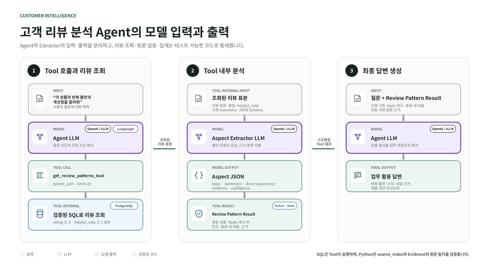
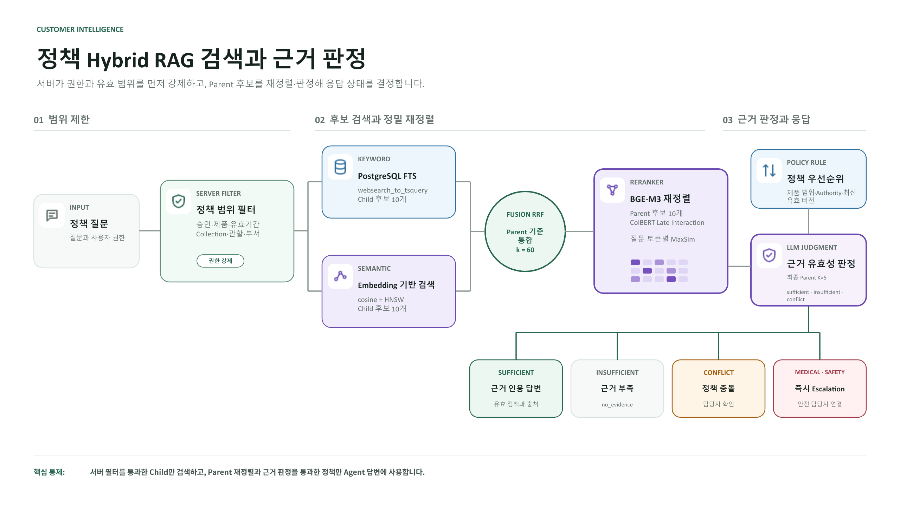
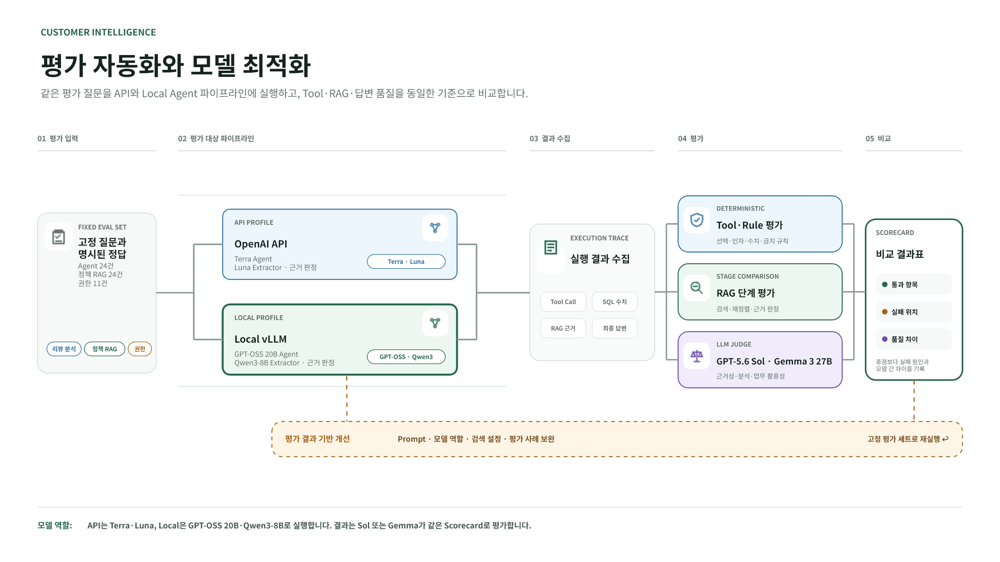

<h1 align="center">Customer Intelligence Agent</h1>

<p align="center">
  <strong>고객 리뷰의 정량 지표와 원문 근거, 적용 가능한 사내 정책을 한 대화에서 확인하는 에이전트</strong><br>
  LLM은 해석에 활용하고, 수치와 권한, 근거는 코드로 검증합니다.
</p>

<p align="center">
  <a href="https://www.python.org/"></a>
  <a href="https://fastapi.tiangolo.com/"></a>
  <a href="https://nextjs.org/"></a>
  <a href="https://www.postgresql.org/"></a>
  <a href="https://redis.io/"></a>
  <a href="https://www.docker.com/"></a>
</p>

<p align="center">
  <a href="#시연-영상">시연 영상</a> ·
  <a href="#문제와-설계">문제와 설계</a> ·
  <a href="#시스템-흐름">시스템 흐름</a> ·
  <a href="#평가-결과">평가 결과</a> ·
  <a href="#빠른-실행">빠른 실행</a> ·
  <a href="README_EN.md">English</a>
</p>

## 시연 영상

상품 리뷰에서 반복 불만과 원문 근거를 찾고, 꼬리질문으로 개선 우선순위를 정한 뒤,
승인된 정책을 검색하거나 근거가 없을 때 답변을 보류하는 전체 흐름을 보여줍니다.

https://github.com/user-attachments/assets/b1d961ff-0d1c-4d03-bbd5-4e9db9d33761

<p align="center">
  <sub>
    <a href="docs/demo/customer-intelligence-demo-ko.mp4">전체 시연 영상 보기 (4분 33초)</a> ·
    <a href="docs/demo/customer-intelligence-demo-ko.srt">한국어 자막</a>
  </sub>
</p>

> **구현 범위** — Amazon Reviews 2023 Beauty and Personal Care의 샴푸 상품
> 547개와 리뷰 105,060건을 분석 대상으로 구성했습니다. 저장소의 정책은 실제 회사
> 문서가 아닌 포트폴리오 검증용 합성 데이터입니다.

## 문제와 설계

대량의 리뷰에서 통계를 계산하고 개선 신호를 찾은 뒤, 관련 정책까지 별도로 검색하는
업무는 시간이 오래 걸립니다. 이 프로젝트는 그 과정을 하나의 대화로 연결하되,
LLM이 수치나 정책을 임의로 만들지 못하도록 책임을 분리했습니다.

| 보장하려는 것 | 적용한 설계 | 결과 |
|---|---|---|
| **정확한 수치** | LLM은 SQL을 만들지 않고 검증된 SQL Tool만 선택 | 조회 조건과 집계 기준을 일관되게 유지 |
| **추적 가능한 근거** | Aspect 근거를 리뷰 원문과 대조하고 정책은 Hybrid RAG로 검색 | 반복 불만과 정책 답변의 출처를 확인 가능 |
| **통제된 의사결정** | 권한·관할·유효기간을 서버에서 강제하고 근거를 별도 판정 | 권한 밖 문서 노출과 근거 없는 정책 안내를 차단 |

## 시스템 흐름

### 1. 고객 리뷰 분석



Agent가 질문에 맞는 SQL Tool을 선택하면 PostgreSQL이 통계와 리뷰 표본을 반환합니다.
Aspect Extractor는 리뷰별 불만 유형·감성·근거 구절을 구조화하고, Python은 근거가
원문에 실제로 존재하는지 확인한 뒤 빈도와 표본 내 비율을 집계합니다. Agent는
이 검증된 결과만 사용합니다.

[고객 리뷰 분석 문서](docs/review-analysis/README.md)에서 Extractor 스키마, 원문 검증,
Redis 캐시와 리뷰별 호출의 비용·정확도 trade-off를 확인할 수 있습니다.

### 2. 정책 Hybrid RAG



서버가 승인 상태, 유효기간, 상품, Collection, 관할, 부서와 사용자 권한을 먼저
적용합니다. PostgreSQL FTS와 Embedding 검색이 각각 Child 후보를 찾고, RRF가 Parent
기준으로 결합합니다. BGE-M3가 관련 조항을 재정렬한 뒤 구조화 LLM이 근거를
`sufficient / insufficient / conflict`로 판정합니다.

[정책 RAG 문서](docs/rag/README.md)에서 Child·Parent 역할, RRF, BGE-M3 MaxSim,
정책 우선순위와 실패 처리를 확인할 수 있습니다.

## 시연에서 확인할 수 있는 결과

리뷰 분석은 선택된 표본의 반복 불만과 실제 언급 문장을 함께 보여주며, 표본 비율을
전체 고객 발생률로 확대하지 않습니다. 정책 답변은 적용 가능한 조항을 출처와 함께
제시하고, 근거가 부족하면 내용을 추측하지 않고 `no_evidence`로 종료합니다.

## 평가 결과

동일한 24개 정책 질문으로 검색 단계를 하나씩 추가하며, 정답 정책을 찾는 비율과
순위가 어떻게 변하는지 확인했습니다. 마지막 단계에서는 검색된 문서가 질문에 직접
답할 수 있는지도 별도로 판정했습니다.



| Pipeline | Recall@K | MRR | No-evidence F1 | p95 Latency |
|---|---:|---:|---:|---:|
| FTS Only | **1.000** | 0.865 | 0.667 | **67.4 ms** |
| Vector Only | 0.875 | 0.812 | 0.714 | 68.7 ms |
| Hybrid RRF | **1.000** | 0.896 | 0.667 | 115.9 ms |
| Hybrid RRF + BGE-M3 | **1.000** | **0.969** | 0.667 | 736.5 ms |
| 전체 파이프라인 + 근거 판별 | **1.000** | **0.969** | **1.000** | 5,703.3 ms |

| 결과가 달라진 이유 | 확인된 변화 |
|---|---|
| FTS·Vector | 빠르게 후보를 찾지만 관련 문서가 실제 답인지까지 판단하지 않음 |
| Hybrid RRF + BGE-M3 | 정확한 용어와 의미 검색을 결합하고 가까운 조항을 위로 올려 MRR이 개선됨 |
| 전체 파이프라인 | 근거 판별이 답할 수 없는 후보를 제거해 `no_evidence`까지 정확히 구분함 |

모든 단계는 채널별 후보 10개와 최종 Parent `K=5`라는 같은 조건을 사용했습니다.
별도 정책 권한 평가 11건에서는 허용 정책 Recall@5 1.000, 차단 정확도 1.000,
권한 밖 문서 노출 0건을 확인했습니다. 다만 작은 합성 정책 세트의 결과이므로 일반
질문 전체의 정확도를 의미하지 않습니다. 실험 목적, 정답 데이터와 재현 방법은
[평가 안내](eval/README.md)에 정리했으며, 공개 범위를 줄인 최종 수치는
[평가 결과 요약](docs/results/README.md)에서 확인할 수 있습니다.

## 빠른 실행

저장소 루트에서 `.env.example`을 복사하고 실제 비밀값은 Git에서 제외되는 `.env`에만
입력합니다.

```powershell
Copy-Item .env.example .env
docker compose --env-file .env `
  -f deploy/compose/local-infra.yaml `
  -f deploy/compose/local-app.yaml up --build
```

- Web: `http://localhost:3000`
- API 준비 상태: `http://localhost:8000/api/ready`

```powershell
pytest -q
python -m eval.run_agent_evaluation
python -m eval.rag_pipeline_comparison
```

Agent와 전체 RAG 평가는 PostgreSQL 데이터와 OpenAI API 설정이 필요합니다. 세부 옵션,
비용이 발생하는 검증과 로컬 모델 실행은 [실행과 배포 문서](deploy/README.md)와
[평가 안내](eval/README.md)에 분리했습니다.

## 기술 구성

| 영역 | 기술 |
|---|---|
| Agent와 분석 | Python, LangGraph, LangChain, Pydantic, pandas |
| 정책 검색 | PostgreSQL FTS, pgvector, RRF, BGE-M3 ColBERT MaxSim |
| Web과 인증 | FastAPI, Next.js, TypeScript, Google OIDC, HttpOnly Cookie |
| 상태와 기록 | Redis, PostgreSQL 대화·출처·감사 로그 |
| 배포와 평가 | Docker Compose, Terraform, EC2, ECR, pytest, LLM Judge |

<details>
<summary><strong>설계 원칙 보기</strong></summary>

- SQL 정확성, 정책 권한, 원문 근거와 안전 경계는 코드가 보장합니다.
- 언어적 해석 품질은 모델 교체와 평가 세트로 관리합니다.
- Tool 결과에 없는 수치, 정책, 인과관계와 안전성 정보를 생성하지 않습니다.
- 동일 우선순위 정책이 충돌하면 Agent가 임의로 결론을 선택하지 않습니다.
- 의료·안전 질문은 일반 답변과 분리해 사람의 검토로 전환합니다.
- OpenAI와 로컬 모델은 같은 Tool, 스키마와 평가 계약을 사용합니다.

</details>

<details>
<summary><strong>실행 프로필 보기</strong></summary>

| 프로필 | 목적 | 구성 | 검증 상태 |
|---|---|---|---|
| Docker 재현 환경 | 코드 리뷰와 주요 기능 재현 | Next.js, FastAPI, PostgreSQL, Redis, OpenAI API | 주요 경로와 회귀 테스트 확인 |
| AWS GPU 검증 환경 | 오픈 모델과 재정렬기 호환성 확인 | EC2 L40S, vLLM, Qwen3, GPT-OSS, BGE-M3 | 대표 상품 분석과 정책 RAG Smoke Test 완료 |
| 상시 운영 환경 | 공개 서비스 운영 | 별도 비용·보안·관측성 정책 필요 | 포트폴리오 범위에서 제외 |

GPU 서비스는 상시 공개하지 않습니다. Terraform으로 필요한 시점에 EC2 환경을 만들고
대표 경로를 확인한 뒤 비용 자원을 제거했습니다. 따라서 `localhost`는 배포 한계가
아니라 저장소를 같은 조건으로 실행하기 위한 재현용 진입점입니다.

</details>

<details>
<summary><strong>프로젝트 구조 보기</strong></summary>

```text
customer-intelligence/
├─ backend/                 # FastAPI API, 인증, 대화와 작업 관리
├─ frontend/                # Next.js 사용자 화면
├─ src/                     # Agent와 핵심 분석 로직
│  ├─ analysis/             # Aspect 추출, 원문 검증과 패턴 집계
│  ├─ rag/                  # 정책 검색, RRF, 재정렬과 근거 판정
│  ├─ prompts/              # Agent 지침과 Grounding 규칙
│  ├─ llm/                  # OpenAI와 vLLM 호출 인터페이스
│  ├─ auth/                 # 인증, 세션과 접근 제어
│  └─ cache/                # Redis 기반 리뷰 분석 캐시
├─ db/                      # PostgreSQL 스키마와 초기화 SQL
├─ data/                    # 합성 정책과 평가 입력 데이터
├─ eval/                    # Agent, RAG와 LLM Judge 평가
├─ tests/                   # Tool, 분석, 권한과 회귀 테스트
├─ deploy/                  # Docker Compose와 AWS 배포 스크립트
├─ infra/terraform/         # EC2, ECR과 네트워크 정의
└─ docs/                    # 상세 설계 문서, 다이어그램과 화면 이미지
```

</details>

## 문서 안내

| 문서 | 확인할 내용 |
|---|---|
| [고객 리뷰 분석](docs/review-analysis/README.md) | SQL 표본, Aspect Extraction, 원문 검증, 집계와 Redis 캐시 |
| [정책 RAG](docs/rag/README.md) | Ingestion, Child·Parent 검색, RRF, BGE-M3와 근거 판정 |
| [평가](eval/README.md) | Agent·Tool·RAG 평가 목적, 실행 명령과 결과 파일 |
| [실행과 배포](deploy/README.md) | 로컬 Compose, ECR 이미지 게시와 EC2 배포 |
| [Terraform](infra/terraform/README.md) | 비용 안전 기본값, EC2 생성, SSM 접속과 종료 |
| [Web 구조](docs/web_architecture.md) | Next.js, FastAPI, OIDC, 세션과 RBAC 경계 |
| [모델 런타임](docs/local_model_runtime.md) | OpenAI, Qwen, GPT-OSS, Gemma 역할과 전환 구조 |
| [핵심 설계 결정](docs/adr/001-review-analysis-and-policy-rag.md) | 리뷰 SQL Tool과 정책 Hybrid RAG를 분리한 이유 |

## 데이터와 현재 상태

Amazon Reviews 2023 원본 전체는 저장소에 재배포하지 않습니다. 실제 `.env`, OAuth
Secret, API Key, DB 내용과 Terraform state도 Git에 포함하지 않습니다.

OpenAI 기반 Web·Agent·정책 검색과 주요 평가 경로를 구현했습니다. AWS L40S에서
Qwen3와 GPT-OSS의 대표 상품 분석 경로, BGE-M3 재정렬 API를 검증했습니다. 로컬 모델
전체 평가와 운영 수준의 관측성·스트리밍은 후속 범위입니다.
