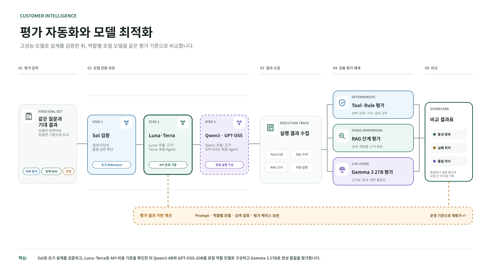

# Customer Intelligence Agent

[한국어](README.md)

A customer intelligence agent that analyzes product and review data to identify recurring complaints, product strengths and weaknesses, and evidence-based improvement priorities.

## Project Goal

The project is designed to reduce the amount of manual review reading and summarization required by marketing, product planning, and VOC teams. Users can ask natural-language questions and receive analyses such as:

- Product information and review overview
- Rating distribution and low-rating ratio analysis
- Helpful review and recurring complaint pattern analysis
- Evidence-based product strength and weakness analysis
- Product, detail-page, and operational improvement recommendations
- Separation of defensible marketing messages from claims that should not be overstated
- Safe handling of missing products and failed searches

## Data

- Dataset: Amazon Reviews 2023
- Category: Beauty and Personal Care
- Products: 547
- Reviews: 105,060
- Negative or neutral reviews rated 3 stars or below: 25,152

Amazon Reviews 2023 is a public research dataset rather than synthetic customer
data. The repository does not redistribute the full raw review corpus; it provides
the processing and ingestion code needed to reproduce the database. The included
policy documents are synthetic samples created for this portfolio project and do
not represent an actual company's internal policies.

`rating_number` represents the total number of ratings shown in Amazon product metadata. `review_count` represents the number of review texts stored in the analysis database.

When the aggregation source is not explicitly included in a Tool response, the agent describes `review_count` as the **retrieved review count** instead of making unsupported claims about its relationship to Amazon's total rating count.

## How It Works

1. The user asks a question about a product or customer response.
2. The agent selects the required retrieval and analysis Tools.
3. The Tools query product and review data from PostgreSQL.
4. The review pattern pipeline runs when recurring complaint analysis is required.
5. The agent combines quantitative statistics, review evidence, and sample limitations.
6. The final response provides key findings and actionable recommendations.

### Customer Review Analysis Path


The Agent selects a predefined and tested SQL Tool instead of generating SQL.
The Aspect Extractor structures complaint types and evidence spans from the
retrieved reviews. Python then verifies that each evidence span exists in the
source text and aggregates frequency and sample-level ratios. The final Agent
uses only the verified result to explain recurring complaints and improvement
priorities.

### Policy Hybrid RAG Path


Policy retrieval first applies the user's access scope and policy validity rules.
PostgreSQL FTS and embedding retrieval are fused with RRF, and BGE-M3 reranks the
candidates before evidence sufficiency is assessed. Only supported policy text
reaches the final answer. Missing evidence, conflicting policies, and medical or
safety issues follow separate fail-closed or human-review paths.

## Core Design Principles

- Do not search for a product when an ASIN is already provided.
- Do not add rating, date, or review-count filters that the user did not request.
- Do not infer complaint causes or customer experiences from rating distributions alone.
- Separate reviewer experiences and claims from verified product information.
- Preserve the category labels returned by the Pattern Tool.
- Distinguish sample-level ratios from population-level incidence rates.
- Do not present unverified authenticity, safety, or causal claims as facts.

## Tech Stack

- Python
- LangGraph / LangChain
- OpenAI API
- PostgreSQL / pgvector
- Docker Compose
- vLLM / Qwen3 / GPT-OSS / Gemma / BGE-M3
- pandas / Parquet
- pytest

## Agent Evaluation

The agent was evaluated on 15 customer and product analysis scenarios using a live PostgreSQL database and the OpenAI API.

The evaluation framework has three layers:

- **Tool evaluation:** validates required, optional, and forbidden Tools and their arguments
- **Rule Checker:** detects unsupported numbers, Tool failures, and sample or aggregation mistakes
- **LLM Judge:** scores accuracy, grounding, analysis, and actionability on a five-point scale



### Validation Scope and Interpretation

The 15 fixed scenarios form a regression and model-comparison baseline. Passing
all of them does not imply equivalent performance across every possible user
question. The project therefore reports what each check establishes and where
its conclusions stop, rather than presenting one near-perfect aggregate score.

| Validation area | What is checked | Interpretation boundary |
|---|---|---|
| Tool calls | Required, optional, and forbidden Tools and their arguments | Regression stability for 15 predefined business scenarios |
| Numeric grounding | Numbers in the response are compared with SQL Tool output | Detects unsupported numbers; source-data accuracy is managed separately |
| Review patterns | Evidence spans are checked against review text before Python aggregation | Ratios describe a selected sample of up to 20 reviews, not population incidence |
| Policy RAG | Access filters, retrieval, reranking, evidence sufficiency, conflict, and no-evidence states | Measures approved evaluation documents and questions; production policies require separate validation |
| Safety and access | Conversation ownership, RBAC, and medical or safety escalation | Prevents unsupported automated decisions and routes high-risk cases to a person |
| Local-model integration | Qwen3 and GPT-OSS review analysis plus BGE-M3 reranking on AWS L40S | A representative-path smoke test, not the full 15-case benchmark |

In the initial full evaluation, E03 overexplained the source of `review_count`
beyond the Tool evidence and lost a grounding point. The wording was changed to
**retrieved review count**, and the regression test now prevents assumptions
about its relationship to Amazon's total rating count. This illustrates how the
evaluation is used to record failure causes and preserve fixes rather than merely
maximize a score.

The recorded local automation completed one product-analysis case. BGE-M3 ranked
the medical and safety policy first in an AWS L40S smoke test. One automated local
policy-RAG case stopped because a network restriction prevented a `tiktoken`
download, not because of a model-quality failure. A full local rerun with the
Gemma Judge remains an explicit follow-up.

### Evaluation Coverage

The evaluation set covers:

- Product lookup and product-name search
- Ambiguous search with multiple candidates
- Rating distribution and low-rating ratios
- Complaint analysis based on highly helpful low-rating reviews
- Natural-language condition translation into Tool arguments
- Recurring complaint and review pattern analysis
- Product strengths, weaknesses, and improvement recommendations
- Marketing claim validation and overstatement risk
- Statistical interpretation and sample limitations
- Missing-product and empty-search handling

### Representative Cases

| Case | Capability | Result |
|---|---|---|
| E03 | Multiple candidates for an ambiguous search | Filters out a non-product result and returns several candidates with ASINs |
| E05 | VOC analysis from helpful low-rating reviews | Connects recurring complaint frequency, evidence, impact, and improvements while stating sample limitations |
| E09 | Combined product, rating, and review-pattern analysis | Produces strengths, weaknesses, and action items from quantitative and qualitative evidence |
| E11 | Marketing analysis | Uses helpful reviews and complaint patterns to separate supportable messages from claims that should not be overstated |
| E15 | Search failure and hallucination prevention | Does not substitute a nonexistent product and requests additional identifying information |

## Testing

Run the full test suite:

```powershell
pytest -q
```

Run selected Agent integration tests:

```powershell
pytest tests/test_agent.py -q -k "ambiguous_product_name"
pytest tests/test_agent.py -q -k "marketing_analysis"
```

Run the Agent evaluation and LLM Judge through the `eval/` module:

```powershell
python -m eval.run_agent_evaluation
python -m eval.run_judge <evaluation-json-path>
```

Integration tests and evaluations call the OpenAI API and therefore require available API credits.

## Project Status

Completed work includes:

- Parquet-to-PostgreSQL data loading and data quality checks
- Product and review retrieval Tools
- LangGraph Agent and Tool-routing rules
- Recurring complaint Pattern analysis pipeline
- Fifteen evaluation scenarios and automated evaluation workflow
- Numeric Checker, Rule Checker, and LLM Judge
- Regression tests for Agent Tool routing and grounding
- FastAPI Agent API and Next.js conversation interface
- Google OIDC login, Redis sessions, three-level RBAC, and policy-scope enforcement
- Separate frontend, backend, reranker, and vLLM container configurations

## Roadmap

1. Add streaming responses and finish the escalation-management workflow
2. Rerun the full local policy-RAG path and Gemma Judge evaluation set
3. Improve semantic review search with embeddings
4. Support time-range, product-group, and competitor comparisons
5. Complete one final EC2 deployment rehearsal and improve observability

## Notes

Local model roles and runtime settings are documented in
[`docs/local_model_runtime.md`](docs/local_model_runtime.md). Web authentication,
session, and authorization boundaries are documented in
[`docs/web_architecture.md`](docs/web_architecture.md).

## Source Data

The agent combines deterministic SQL retrieval for structured product and
review data with hybrid RAG for internal operational policies. PostgreSQL FTS
and pgvector generate candidates, BGE-M3 multi-vector scoring reranks them with
ColBERT late interaction, and a structured LLM check permits only directly
supported evidence to reach the Agent.

Install the optional local reranking dependencies before running policy search:

```powershell
.\.venv\Scripts\python.exe -m pip install -r requirements-rag-rerank.txt
```

Compare the PostgreSQL baseline, ColBERT reranking, and full evidence-validation
pipeline with the same fixed Korean cases:

```powershell
python -m eval.rag_pipeline_comparison
```

JSON and CSV reports are written under `eval/results/` without applying an
arbitrary acceptance threshold.

The BGE-M3 stage was evaluated with a Colab A100 retrieval set and a single
ranking and API smoke test on AWS L40S. It remains disabled in the default local
Web stack because of resource constraints and runs as a separate GPU service in
the AWS configuration.

The evaluated default is 10 candidates per retrieval channel. Reranker
failures fall back to RRF order by default
(`RAG_RERANKER_FALLBACK_TO_RRF=true`), while evidence-validation failures
remain fail-closed as `no_evidence`. The evidence timeout/retry defaults are 15
seconds and one retry.

See [ADR-001](docs/adr/001-hybrid-sql-rag-architecture.md).
