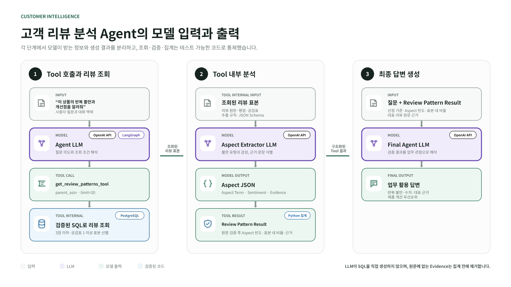
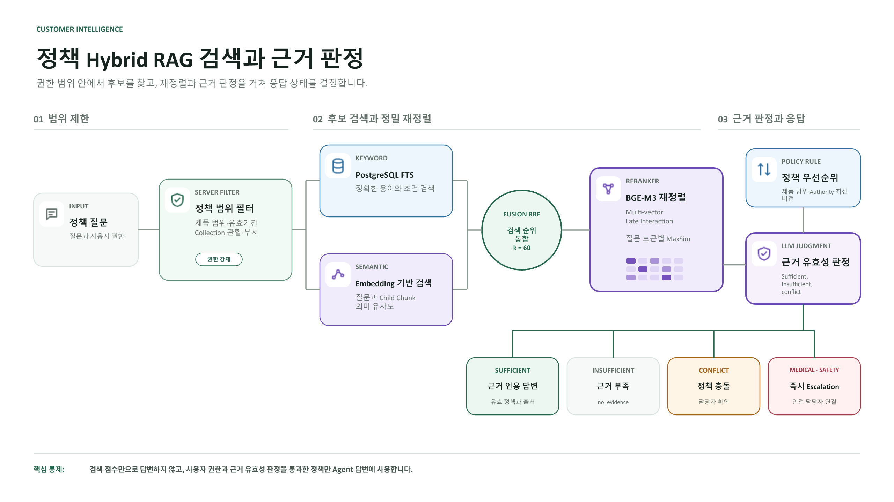
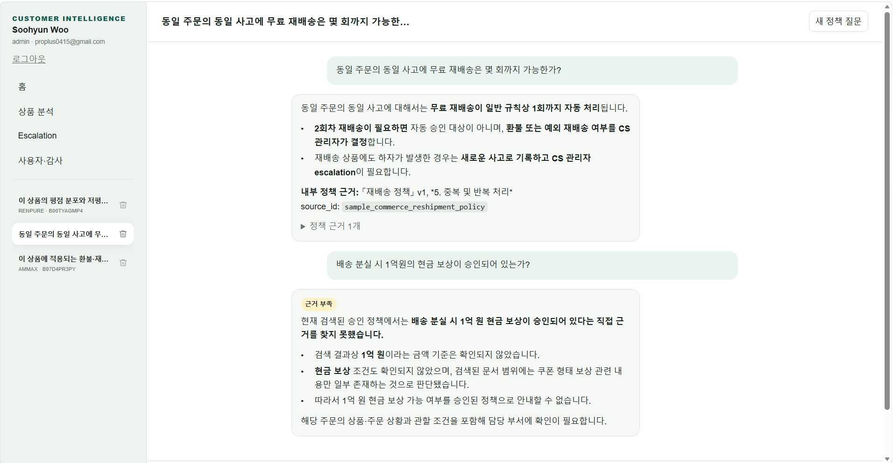
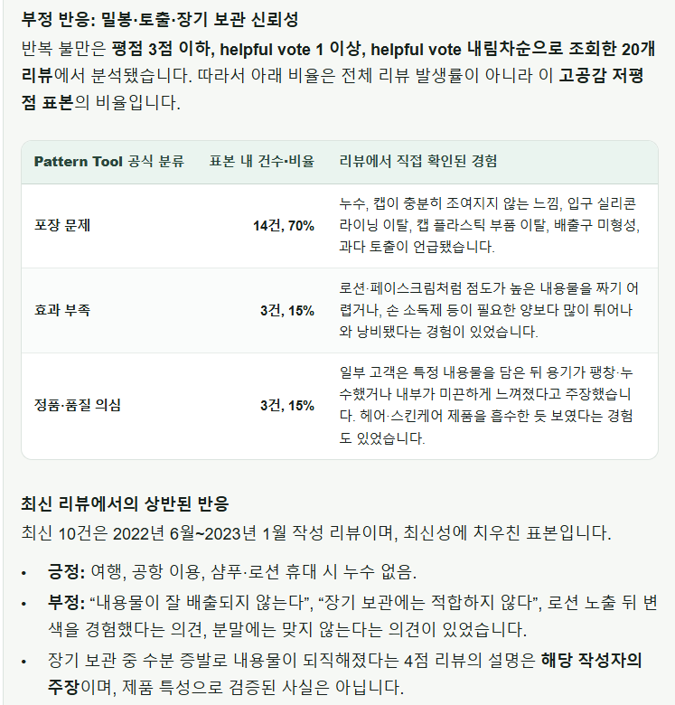

# Customer Intelligence Agent

[한국어](README.md)

Customer reviews contain valuable product-improvement signals, but practitioners
must usually select reviews, calculate statistics, and search relevant policies
in separate workflows. This project brings those tasks into one conversation so
that users can examine **quantitative indicators, source-review evidence, and
applicable internal policy together**.

The system uses the flexibility of an LLM without delegating high-cost errors,
such as numerical calculation and access control, to the model. Review metrics
come from tested SQL Tools, while policy retrieval applies user permissions and
validity dates before Hybrid RAG. The goal is to preserve natural-language
convenience while reducing **fabricated numbers, unsupported policy guidance,
and exposure of unauthorized documents**.

## Core Design

| Limitation to address | Design choice | Intended effect |
|---|---|---|
| LLM-generated SQL can change filters and aggregation criteria | Restrict the LLM to selecting tested SQL Tools | Produce quantitative results under consistent rules |
| Rating statistics alone do not reveal concrete complaint causes | Extract aspects, sentiment, and evidence spans from low-rated reviews, then verify and aggregate them in Python | Connect recurring complaints and priorities to source reviews |
| Keyword and semantic retrieval can miss different kinds of relevant policy | Fuse PostgreSQL FTS and embedding retrieval with RRF, then rerank with BGE-M3 MaxSim | Preserve both exact policy terminology and semantic similarity |
| An LLM may answer even when retrieved evidence is insufficient | Classify evidence as `sufficient / insufficient / conflict` | Expose missing or conflicting evidence instead of inventing guidance |
| Uniform policy access can expose documents outside a user's scope | Enforce collection, jurisdiction, department, and RBAC filters on the server | Retrieve only authorized and currently valid policy |
| A high aggregate score alone does not explain operational reliability | Evaluate Tool accuracy, numerical grounding, evidence quality, and business usefulness | Compare model quality and cost under the same contract |

## Implementation Scope

The analysis dataset contains 547 Beauty and Personal Care products and 105,060
reviews from Amazon Reviews 2023. Review analysis, policy retrieval, evidence
assessment, and access control are connected to Google OIDC, Redis sessions, and
conversation ownership, making the project an **MVP for validating an operational
workflow rather than a standalone RAG demonstration**.

## System Flows

### Customer review analysis



The Agent selects a predefined SQL Tool and PostgreSQL returns the requested
sample and statistics. The Aspect Extractor structures complaint types and
evidence spans. Python verifies that each span exists in the original review and
aggregates counts and sample-level ratios. The final Agent consumes only the
validated structured result.

The [customer review analysis guide](docs/review-analysis/README_EN.md) documents
the Extractor schema, Python source validation, Redis caching, and the trade-offs
of per-review model calls.

### Policy Hybrid RAG



The retriever first enforces approval status, validity period, product scope,
collection, jurisdiction, department, and user access. PostgreSQL FTS and
embedding retrieval independently find Child chunks. RRF fuses them by Parent,
BGE-M3 reranks the Parent sections, and a structured LLM classifies evidence as
`sufficient`, `insufficient`, or `conflict`.

Candidate counts, Child/Parent responsibilities, policy priority, and failure
behavior are documented in the [Policy RAG guide](docs/rag/README_EN.md).

## Service Screens

| Policy grounding and abstention | Review statistics and complaint patterns |
|---|---|
|  |  |

When policy evidence is insufficient, the system returns `no_evidence` instead
of inventing a rule. Review-pattern ratios are explicitly described as ratios
within the selected sample, not population incidence.

## Design Principles

- Code enforces SQL accuracy, policy access, source grounding, and safety boundaries.
- Model interpretation quality is managed through model replacement and evaluation.
- Responses must not invent numbers, policy conditions, causality, or safety claims.
- Equal-priority policy conflicts are never resolved arbitrarily by the Agent.
- Medical and safety cases leave the normal answer path for human review.
- OpenAI and local models share the same Tool, schema, and evaluation contracts.

## Technology

| Area | Technology |
|---|---|
| Agent and LLM | Python, LangGraph, LangChain, OpenAI API, vLLM |
| Analysis | SQL, pandas, Pydantic, Aspect Term Extraction |
| RAG | PostgreSQL FTS, pgvector, RRF, BGE-M3 ColBERT MaxSim |
| Web | FastAPI, Next.js, TypeScript |
| Identity and state | Google OIDC, Redis, HttpOnly cookies, PostgreSQL audit logs |
| Deployment and evaluation | Docker Compose, Terraform, EC2, ECR, pytest, LLM Judge |

## Evaluation and Interpretation

The project separates guarantees enforced by code from language quality that
remains model-dependent instead of presenting one near-perfect aggregate score.

| Layer | What it checks | Interpretation boundary |
|---|---|---|
| Tool | Required, optional, and forbidden Tools and arguments | Routing regression for defined business scenarios |
| Rule checker | Unsupported SQL numbers, evidence spans, and sample wording | Violations of system invariants |
| Policy RAG | Access, retrieval, reranking, sufficiency, and conflict states | Approved evaluation policies and questions |
| LLM Judge | Accuracy, grounding, analysis, and actionability | Relative model comparison and failure analysis |
| Security and safety | Ownership, RBAC, and escalation | Boundaries that restrict automated decisions |

The suite includes 15 customer and product scenarios plus stage-by-stage policy
RAG evaluation. Passing the fixed set does not guarantee performance for every
possible query, so failures and regression rules are recorded together. See the
[evaluation guide](eval/README_EN.md) for commands and outputs.

## Quick Start

From the repository root, copy `.env.example` and keep real secrets only in the
ignored `.env` file.

```powershell
Copy-Item .env.example .env
docker compose --env-file .env `
  -f deploy/compose/local-infra.yaml `
  -f deploy/compose/local-app.yaml up --build
```

- Web: `http://localhost:3000`
- API readiness: `http://localhost:8000/api/ready`

Start the core regression checks with:

```powershell
pytest -q
python -m eval.run_agent_evaluation
python -m eval.rag_pipeline_comparison --stages baseline,rerank,full
```

Agent and full RAG evaluations require PostgreSQL data and OpenAI API settings.
Detailed options, paid validation paths, and local-model commands are kept in
the focused guides below.

## Project Structure

Only the paths needed to understand execution and core logic are shown. Local
caches, generated artifacts, and minor helper files are intentionally omitted.

```text
customer-intelligence/
├─ backend/                 # FastAPI API, authentication, conversations, and jobs
├─ frontend/                # Next.js user interface
├─ src/                     # Agent and core analysis logic
│  ├─ analysis/             # Aspect extraction, source validation, and aggregation
│  ├─ rag/                  # Policy retrieval, RRF, reranking, and evidence assessment
│  ├─ prompts/              # Agent instructions and grounding rules
│  ├─ llm/                  # OpenAI and vLLM role configuration and client interfaces
│  ├─ auth/                 # Authentication, sessions, and access control
│  └─ cache/                # Redis-backed review-analysis cache
├─ db/                      # PostgreSQL schema and initialization SQL
├─ data/                    # Sample policies and evaluation inputs
├─ eval/                    # Automated Agent, RAG, and LLM-judge evaluation
├─ tests/                   # Tool, analysis, authorization, and regression tests
├─ deploy/                  # Docker Compose and AWS deployment scripts
├─ infra/terraform/         # EC2, ECR, and network infrastructure definitions
└─ docs/                    # Design guides, diagrams, and interface screenshots
```

## Documentation

| Guide | Scope |
|---|---|
| [Customer review analysis](docs/review-analysis/README_EN.md) | SQL sampling, Aspect Extraction, source validation and aggregation, Redis caching, and limitations |
| [Policy RAG](docs/rag/README_EN.md) | Ingestion, Child/Parent retrieval, RRF, BGE-M3, priority, and evidence gating |
| [Evaluation](eval/README_EN.md) | Agent, Tool, Judge, RAG, and local-model evaluation commands and outputs |
| [Run and deploy](deploy/README_EN.md) | Local Compose, ECR image publishing, and EC2 deployment |
| [Terraform](infra/terraform/README_EN.md) | Cost-safe defaults, EC2 provisioning, SSM access, and teardown |
| [Web architecture](docs/web_architecture.md) | Next.js, FastAPI, OIDC, sessions, and RBAC boundaries |
| [Model runtime](docs/local_model_runtime.md) | OpenAI, Qwen, GPT-OSS, and Gemma roles and switching |
| [Architecture decision](docs/adr/001-hybrid-sql-rag-architecture.md) | Why SQL and Hybrid RAG are separated |

## Data and Publication Scope

- Amazon Reviews 2023 is a public research dataset; the full raw corpus is not redistributed here.
- Included sample policies are synthetic portfolio data, not real company policy.
- Real `.env` files, OAuth secrets, API keys, database contents, and Terraform state are not embedded in images or Git.

## Status

The OpenAI Web, Agent, policy retrieval path, and core regression tests are
implemented. Representative Qwen3 and GPT-OSS product-analysis paths and the
BGE-M3 reranking API were smoke-tested on AWS L40S. A full local-model evaluation
run and production-grade observability and streaming remain follow-up work.
