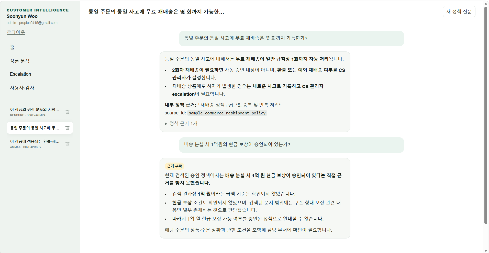
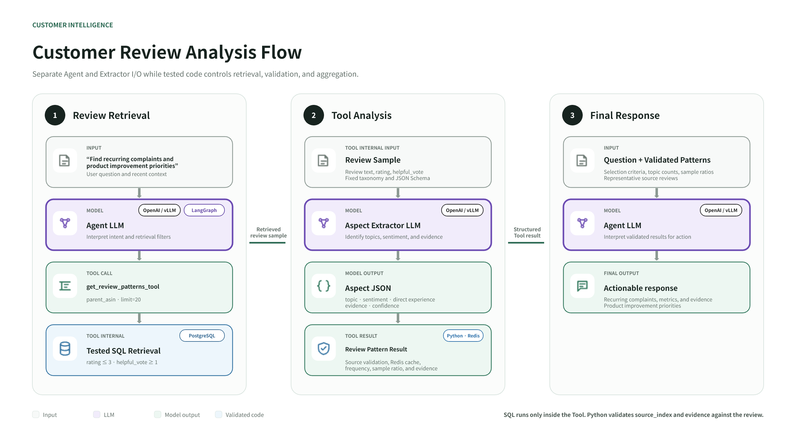
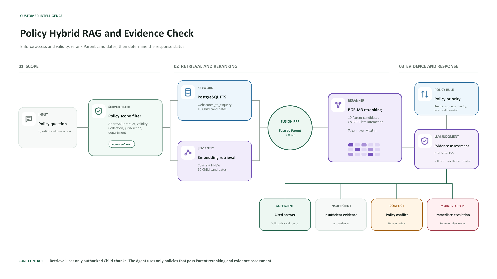
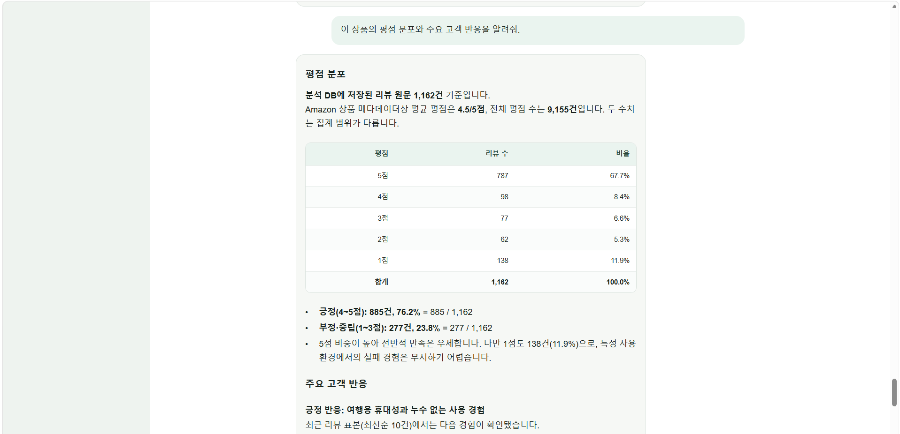
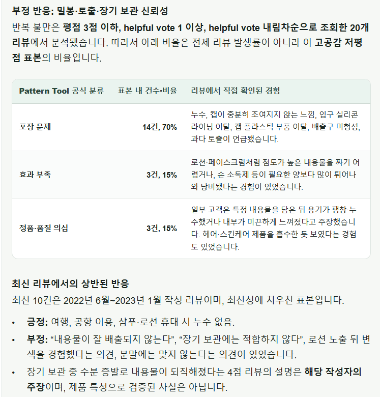
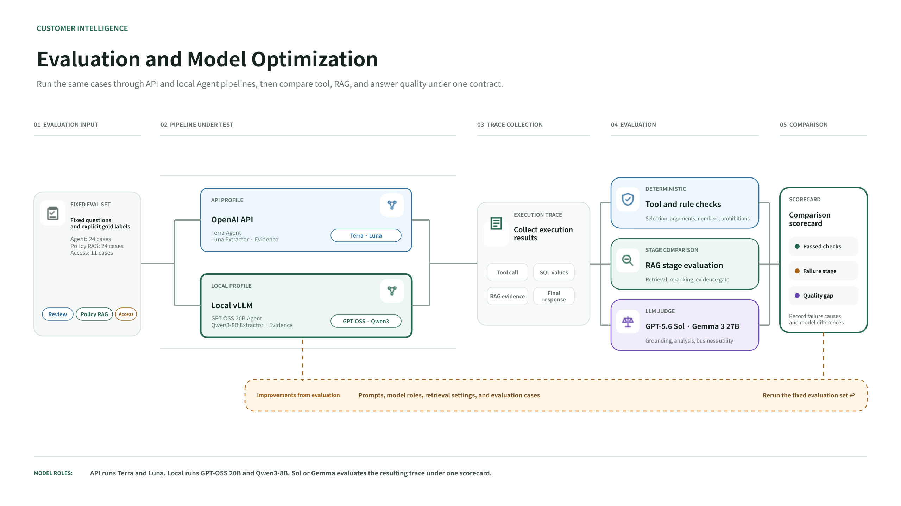

<h1 align="center">Customer Intelligence Agent</h1>

<p align="center">
  <strong>An Agent that connects review metrics, source evidence, and applicable internal policy in one conversation</strong><br>
  It uses LLMs for interpretation while keeping numbers, access, and evidence under deterministic control.
</p>

<p align="center">
  <a href="https://www.python.org/"></a>
  <a href="https://fastapi.tiangolo.com/"></a>
  <a href="https://nextjs.org/"></a>
  <a href="https://www.postgresql.org/"></a>
  <a href="https://redis.io/"></a>
  <a href="https://www.docker.com/"></a>
</p>

<p align="center">
  <a href="#problem-and-design">Problem &amp; Design</a> ·
  <a href="#system-flows">System Flows</a> ·
  <a href="#evaluation-results">Evaluation</a> ·
  <a href="#quick-start">Quick Start</a> ·
  <a href="README.md">한국어</a>
</p>



> **Scope** — The analysis dataset contains 547 shampoo products and 105,060
> reviews from the Beauty and Personal Care category of Amazon Reviews 2023.
> Policies in this repository are synthetic portfolio data, not real company policy.

## Problem and Design

Reviewing large volumes of customer feedback, calculating consistent metrics,
and locating the relevant policy are usually separate tasks. This project joins
them in one conversation while separating responsibilities so the LLM cannot
invent numbers or policy conditions.

| Guarantee | Design choice | Outcome |
|---|---|---|
| **Accurate numbers** | The LLM selects tested SQL Tools instead of generating SQL | Filters and aggregation rules remain consistent |
| **Traceable evidence** | Aspect evidence is checked against source reviews, while policy uses Hybrid RAG | Recurring complaints and policy answers remain auditable |
| **Controlled decisions** | The server enforces access, jurisdiction, and validity before a separate evidence check | Unauthorized documents and unsupported guidance are blocked |

## System Flows

### 1. Customer review analysis



The Agent selects the SQL Tool that matches the question, and PostgreSQL returns
statistics and a review sample. The Aspect Extractor structures complaint types,
sentiment, and evidence spans. Python verifies each span against the original
review, then aggregates counts and sample-level ratios. The Agent consumes
only this validated result.

The [customer review analysis guide](docs/review-analysis/README_EN.md) explains
the Extractor schema, source validation, Redis caching, and the cost–accuracy
trade-off of per-review model calls.

### 2. Policy Hybrid RAG



The server first applies approval status, validity period, product scope,
collection, jurisdiction, department, and user access. PostgreSQL FTS and
embedding retrieval independently find Child candidates, and RRF fuses them by
Parent. BGE-M3 reranks the relevant clauses before a structured LLM classifies
the evidence as `sufficient`, `insufficient`, or `conflict`.

The [Policy RAG guide](docs/rag/README_EN.md) explains Child and Parent roles,
RRF, BGE-M3 MaxSim, policy priority, and failure behavior.

## What the User Sees

| Review metrics and interpretation boundaries | Recurring complaints with source evidence |
|---|---|
|  |  |

Review-pattern ratios are explicitly presented as ratios within the selected
sample, not population incidence. When policy evidence is insufficient, the
system returns `no_evidence` instead of inventing a rule.

## Evaluation Results

The same 24 policy questions were run through each retrieval stage to measure
how often the correct policy was found and how its rank changed. The final stage
also checked whether the retrieved document directly answered the question.



| Pipeline | Recall@K | MRR | No-evidence F1 | p95 Latency |
|---|---:|---:|---:|---:|
| FTS Only | **1.000** | 0.865 | 0.667 | **67.4 ms** |
| Vector Only | 0.875 | 0.812 | 0.714 | 68.7 ms |
| Hybrid RRF | **1.000** | 0.896 | 0.667 | 115.9 ms |
| Hybrid RRF + BGE-M3 | **1.000** | **0.969** | 0.667 | 736.5 ms |
| Full pipeline + evidence assessment | **1.000** | **0.969** | **1.000** | 5,703.3 ms |

| Why the result changes | Observed effect |
|---|---|
| FTS and Vector | Retrieve candidates quickly but do not determine whether a related document answers the question |
| Hybrid RRF + BGE-M3 | Combine exact terminology with semantic search and promote the closest clause, improving MRR |
| Full pipeline | Remove candidates that cannot support an answer and correctly separate `no_evidence` cases |

Every stage used the same limit of ten candidates per retrieval channel and a
final Parent `K=5`. A separate 11-case access evaluation reported 1.000
authorized Recall@5, 1.000 denial accuracy, and zero out-of-scope exposures.
Because this is a small synthetic policy set, these numbers are not an estimate
of accuracy for arbitrary questions. The [evaluation guide](eval/README_EN.md)
documents the intent, gold data, and reproduction steps.

## Quick Start

From the repository root, copy `.env.example` and keep real secrets only in the
ignored `.env` file.

```powershell
Copy-Item .env.example .env
docker compose --env-file .env `
  -f deploy/compose/local-infra.yaml `
  -f deploy/compose/local-app.yaml up --build
```

- Web: `http://localhost:3000`
- API readiness: `http://localhost:8000/api/ready`

```powershell
pytest -q
python -m eval.run_agent_evaluation
python -m eval.rag_pipeline_comparison
```

Agent and full RAG evaluations require PostgreSQL data and OpenAI API settings.
Detailed options, paid validation paths, and local-model commands are separated
into the [run and deployment guide](deploy/README_EN.md) and the
[evaluation guide](eval/README_EN.md).

## Technology

| Area | Technology |
|---|---|
| Agent and analysis | Python, LangGraph, LangChain, Pydantic, pandas |
| Policy retrieval | PostgreSQL FTS, pgvector, RRF, BGE-M3 ColBERT MaxSim |
| Web and identity | FastAPI, Next.js, TypeScript, Google OIDC, HttpOnly cookies |
| State and records | Redis, PostgreSQL conversation, source, and audit records |
| Deployment and evaluation | Docker Compose, Terraform, EC2, ECR, pytest, LLM Judge |

<details>
<summary><strong>Design principles</strong></summary>

- Code enforces SQL accuracy, policy access, source grounding, and safety boundaries.
- Model interpretation quality is managed through model replacement and evaluation.
- Responses must not invent numbers, policy conditions, causality, or safety claims.
- Equal-priority policy conflicts are never resolved arbitrarily by the Agent.
- Medical and safety cases leave the normal answer path for human review.
- OpenAI and local models share the same Tool, schema, and evaluation contracts.

</details>

<details>
<summary><strong>Execution profiles</strong></summary>

| Profile | Purpose | Configuration | Validation status |
|---|---|---|---|
| Reproducible Docker environment | Code review and functional reproduction | Next.js, FastAPI, PostgreSQL, Redis, OpenAI API | Core paths and regression tests verified |
| AWS GPU validation environment | Open-model and reranker compatibility | EC2 L40S, vLLM, Qwen3, GPT-OSS, BGE-M3 | Representative product-analysis and policy-RAG smoke tests completed |
| Always-on production environment | Public service operation | Requires separate cost, security, and observability policies | Outside the portfolio scope |

GPU services are not kept publicly available. Terraform creates the EC2
environment when needed, representative paths are checked, and billable
resources are removed afterward. The `localhost` addresses above are therefore
reproducible entry points, not a limit of the deployment design.

</details>

<details>
<summary><strong>Project structure</strong></summary>

```text
customer-intelligence/
├─ backend/                 # FastAPI API, authentication, conversations, and jobs
├─ frontend/                # Next.js user interface
├─ src/                     # Agent and core analysis logic
│  ├─ analysis/             # Aspect extraction, source validation, and aggregation
│  ├─ rag/                  # Policy retrieval, RRF, reranking, and evidence assessment
│  ├─ prompts/              # Agent instructions and grounding rules
│  ├─ llm/                  # OpenAI and vLLM client interfaces
│  ├─ auth/                 # Authentication, sessions, and access control
│  └─ cache/                # Redis-backed review-analysis cache
├─ db/                      # PostgreSQL schema and initialization SQL
├─ data/                    # Synthetic policies and evaluation inputs
├─ eval/                    # Agent, RAG, and LLM-judge evaluation
├─ tests/                   # Tool, analysis, authorization, and regression tests
├─ deploy/                  # Docker Compose and AWS deployment scripts
├─ infra/terraform/         # EC2, ECR, and network definitions
└─ docs/                    # Design guides, diagrams, and interface screenshots
```

</details>

## Documentation

| Guide | What it covers |
|---|---|
| [Customer review analysis](docs/review-analysis/README_EN.md) | SQL sampling, Aspect Extraction, source validation, aggregation, and Redis caching |
| [Policy RAG](docs/rag/README_EN.md) | Ingestion, Child and Parent retrieval, RRF, BGE-M3, and evidence assessment |
| [Evaluation](eval/README_EN.md) | Agent, Tool, and RAG evaluation intent, commands, and result files |
| [Run and deploy](deploy/README_EN.md) | Local Compose, ECR image publishing, and EC2 deployment |
| [Terraform](infra/terraform/README_EN.md) | Cost-safe defaults, EC2 provisioning, SSM access, and teardown |
| [Web architecture](docs/web_architecture.md) | Next.js, FastAPI, OIDC, sessions, and RBAC boundaries |
| [Model runtime](docs/local_model_runtime.md) | OpenAI, Qwen, GPT-OSS, and Gemma roles and switching |
| [Core architecture decision](docs/adr/001-review-analysis-and-policy-rag_EN.md) | Why review SQL Tools and Policy Hybrid RAG are separated |

## Data and Current Status

The full Amazon Reviews 2023 corpus is not redistributed in this repository.
Real `.env` files, OAuth secrets, API keys, database contents, and Terraform
state are also excluded from Git.

The OpenAI Web, Agent, policy retrieval, and primary evaluation paths are
implemented. Representative Qwen3 and GPT-OSS product-analysis paths and the
BGE-M3 reranking API were validated on AWS L40S. Full local-model evaluation and
production-grade observability and streaming remain follow-up work.
